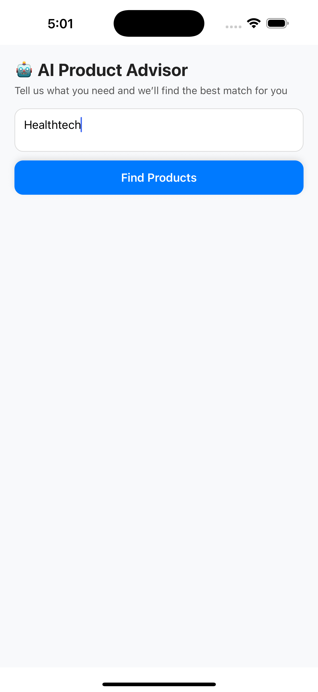

# 🤖 AI Product Advisor App

## 📌 Overview
This is a React Native application that acts as an **AI Product Advisor**.  
Users can describe their needs in natural language, and the app recommends the best products from a predefined catalog, along with reasons for the recommendations.

---

## 🏗 Architecture

- **App.js**  
  Root component, loads the `AdvisorScreen`.

- **src/AdvisorScreen.js**  
  Main screen that:
  - Accepts user input.
  - Sends a query to a Generative AI model (Google Gemini or OpenAI).
  - Displays product recommendations.

- **src/skus.json**  
  Product catalog (array of objects) used as the database.

- **src/components/ProductCard.js**  
  Reusable UI component to display product info and AI reasoning.

---

## 🚀 Approach

1. **Natural Language Input**  
   Users type a description of their needs.

2. **AI Integration**  
   - Construct a prompt combining the user’s input + product catalog.
   - Send it to a Generative AI API (Gemini or OpenAI).
   - Parse the response to extract product recommendations + reasoning.

3. **Recommendations Display**  
   - Show product name, brand, category, and price.
   - Show "why" the AI recommended it.

---

## 📂 File Structure

/my-ai-advisor-app
|-- /src
| |-- /components
| | |-- ProductCard.js
| |-- AdvisorScreen.js
| |-- skus.json
|-- App.js
|-- README.md
|-- package.json


---

## ⚙️ Setup & Run

1. Clone or open the project in [Snack Expo](https://snack.expo.dev/)  

2. Install dependencies:
   ```bash
   npm install
   npm start

3. Important:
In AdvisorScreen.js, update the Gemini API call with your own API key:

const response = await fetch(
  "https://generativelanguage.googleapis.com/v1beta/models/gemini-1.5-flash:generateContent?key=YOUR_API_KEY",
  {
    method: "POST",
    headers: { "Content-Type": "application/json" },
    body: JSON.stringify({
      contents: [{ role: "user", parts: [{ text: prompt }] }],
    }),
  }
);

## Replace:

## YOUR_API_KEY with your Google Gemini API key.
(If you want to use OpenAI instead, just change the endpoint and model name to gpt-4o-mini.)

## 🔄 Switching Between Gemini and OpenAI
## Using Gemini

const response = await fetch(
  "https://generativelanguage.googleapis.com/v1beta/models/gemini-1.5-flash:generateContent?key=YOUR_API_KEY",
  {
    method: "POST",
    headers: { "Content-Type": "application/json" },
    body: JSON.stringify({
      contents: [{ role: "user", parts: [{ text: prompt }] }],
    }),
  }
);
const data = await response.json();
const text = data.candidates?.[0]?.content?.parts?.[0]?.text || "[]";

## Using OpenAI

const response = await fetch("https://api.openai.com/v1/chat/completions", {
  method: "POST",
  headers: {
    "Content-Type": "application/json",
    Authorization: `Bearer YOUR_OPENAI_API_KEY`,
  },
  body: JSON.stringify({
    model: "gpt-4o-mini",
    messages: [{ role: "user", content: prompt }],
    temperature: 0.7,
  }),
});
const data = await response.json();
const text = data.choices?.[0]?.message?.content || "[]";

## 📸 Screenshots

<p align="center">
  
  
  
</p>
